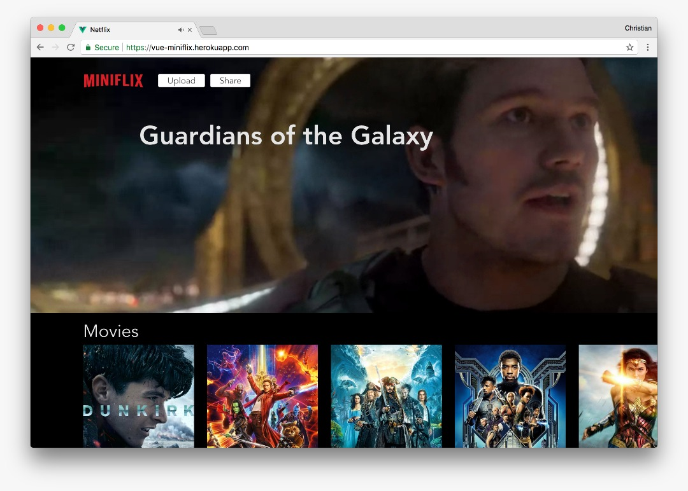

# Introduction

You as developers face the continuous challenge of building complex products with elaborate features in the face of tight schedules. Behind the scenes, engineering and product management constantly aims at beating project deadlines; CEOs clamor for fast rollouts of new products; and entrepreneurs need their minimum viable products \(MVPs\) "yesterday." How do you cope with those relentless demands? First and foremost, look for ways to boost efficiency for your tasks.

This lab shows you how to build a **Mini-Netflix** clone with Vue and Cloudinary in only 10 minutes or maybe even less. Here is a live [demo](https://stupefied-mirzakhani-71dd38.netlify.com/).

To check out the final project, visit the Github repository:

* [Client code](https://github.com/cloudinary-developers/vue-mini-netflix-demo-client)
* [Server code](https://github.com/cloudinary-developers/vue-mini-netflix-demo-server)

[Demo](https://vue-miniflix.herokuapp.com)

## Prerequisites

You must have a working knowledge of [Vue](https://vuejs.org/) and JavaScript and, since this lab calls for creation of [webtasks](https://webtask.io/), you must understand the basics of serverless computing. In addition, you must be adept with [NodeJS](https://nodejs.org/), which enables the programming of webtasks.

Install these tools:

* [Vue](https://vuejs.org)
* [Webtask](https://webtask.io/)
* [Node.js](https://nodejs.org/en/)
* [Cloudinary](https://cloudinary.com/)
* [Mongo DB with mLab](https://mlab.com/)
* Command line
* [Bulma CSS](https://bulma.io)

## Clone Tasks

The mini-Netflix clone you will build features the following tasks, similar to those on the Netflix site:

* Listing movies
* Selecting movies
* Watching movie trailers
* Sharing trailers on Twitter
* Uploading new movie trailers \(bonus\)

## The Build Process

The architecture of this project favors decentralization, not singleton, with three major sections:

* Front end \(Vue\)
* Back end \(webtask FaaS\)
* Database \(Mongo\)

